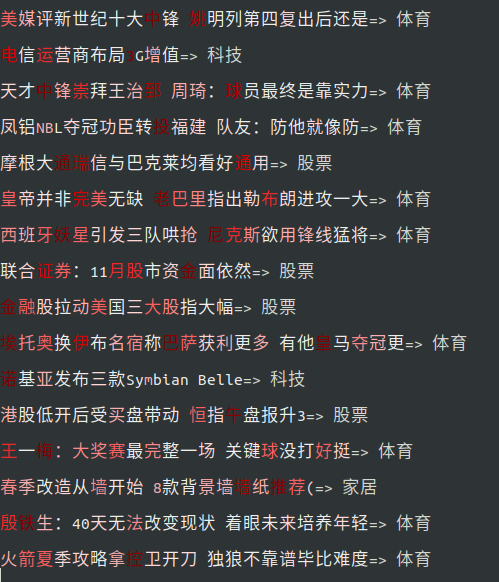
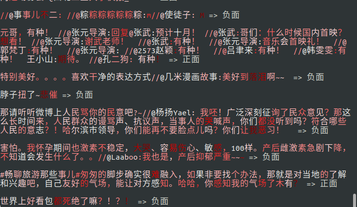
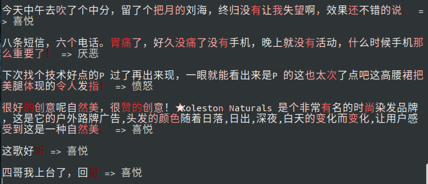
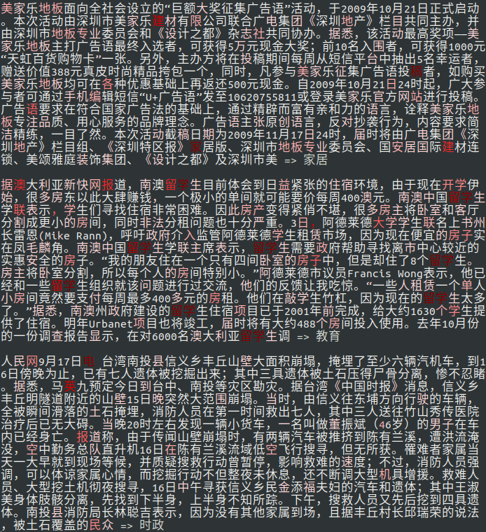
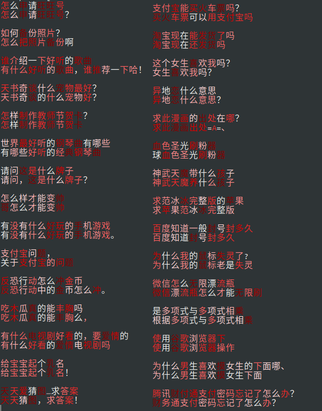
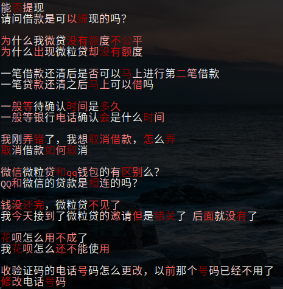

# text-attentionpooling-visualization

AttentionPooling在分类和匹配问题上的可视化分析。GlobalMaxPool请看[text-globalmaxpool-visualization](https://github.com/allenwind/text-globalmaxpool-visualization)。

## 分类问题示例

示例一：

新闻标题分类，

示例二：

正负情感分类，

示例三：

四情感分类，

示例四：

长文分类，

## 匹配问题示例

示例五：

文本匹配Attentionpooling可视化示例一，

文本匹配Attentionpooling可视化示例二，

## 数据来源

[1] http://thuctc.thunlp.org/

[2] https://github.com/SophonPlus/ChineseNlpCorpus/blob/master/datasets/weibo_senti_100k/intro.ipynb

[3] https://github.com/SophonPlus/ChineseNlpCorpus/blob/master/datasets/simplifyweibo_4_moods/intro.ipynb

[4] https://www.aclweb.org/anthology/C18-1166/
