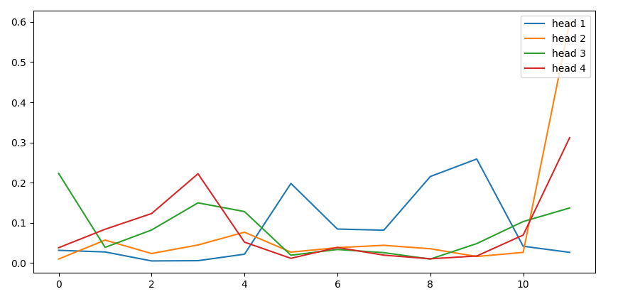

# text-attentionpooling-visualization

AttentionPooling和MultiHeadAttentionPooling在分类和匹配问题上的可视化分析。GlobalMaxPool请看[text-globalmaxpool-visualization](https://github.com/allenwind/text-globalmaxpool-visualization)。


AttentionPooling1D中call函数：

```python
class AttentionPooling1D(tf.keras.layers.Layer):

    def call(self, inputs, mask=None):
        if mask is None:
            mask = 1
        else:
            # 扩展维度便于广播
            mask = tf.expand_dims(tf.cast(mask, tf.float32), -1)
        x0 = inputs
        # 计算每个 time steps 权重
        w = self.k_dense(inputs)
        w = self.o_dense(w)
        # 处理 mask
        w = w - (1 - mask) * 1e12
        # 权重归一化
        w = tf.math.softmax(w, axis=1) # 有mask位置对应的权重变为很小的值
        # 加权平均
        x = tf.reduce_sum(w * x0, axis=1)
        return x, w
```

在这个基础上可以进行多头化操作，称为MultiHeadAttentionPooling1D，以扩展关键信息的捕获能力。


## 分类问题示例

示例一：

新闻标题分类，


示例二：

正负情感分类，


示例三：

四情感分类，


示例四：

长文分类，


## 匹配问题示例

示例五：

文本匹配Attentionpooling可视化示例一，


文本匹配Attentionpooling可视化示例二，


## 基于交互的匹配示例

示例一，


示例二，


## 多头Pooling示例

MultiHeadAttentionPooling可视化示例一（情感分析），


其对应的Attention权重可视化，




MultiHeadAttentionPooling可视化示例二（酒店评论一），


其对应的Attention权重可视化，


MultiHeadAttentionPooling可视化示例二（酒店评论二），


其对应的Attention权重可视化，


MultiHeadAttentionPooling可视化示例三（新闻分类），


其对应的Attention权重可视化，


## 数据来源

[1] http://thuctc.thunlp.org/

[2] https://github.com/SophonPlus/ChineseNlpCorpus/blob/master/datasets/weibo_senti_100k/intro.ipynb

[3] https://github.com/SophonPlus/ChineseNlpCorpus/blob/master/datasets/simplifyweibo_4_moods/intro.ipynb

[4] https://www.aclweb.org/anthology/C18-1166/
